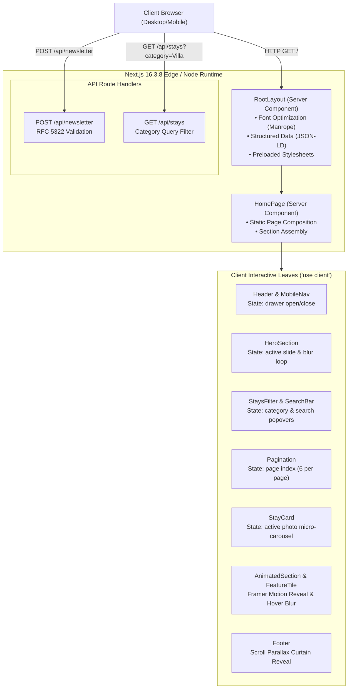
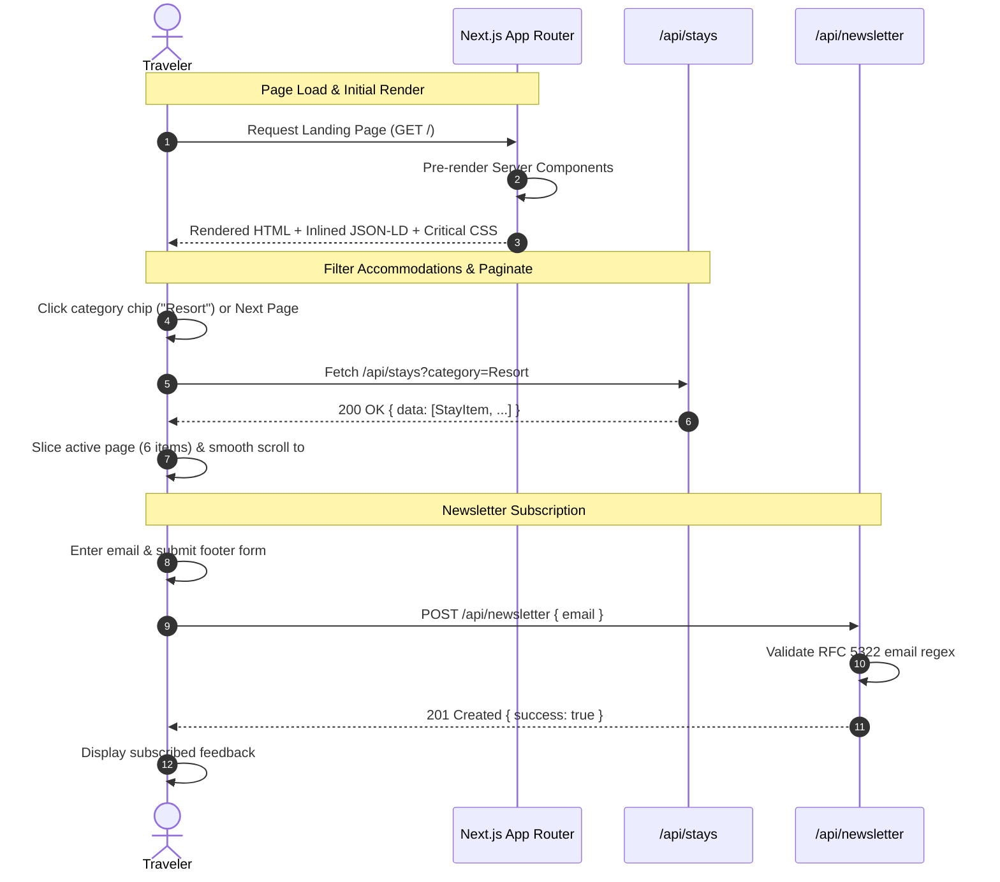

### WANDERLUSH — SYSTEM ARCHITECTURE SPECIFICATION

**Developer:** Aaditya Gunjal - Full Stack Developer

---

## 1. System Context Diagram

---

## 2. Request & Hydration Pipeline

1. **Initial Edge Request:**  
   The user agent requests `GET /`. Next.js executes the Server Components `app/layout.tsx` and `app/page.tsx` on the server.
2. **HTML Stream & Meta Injection:**  
   HTML is streamed to the browser with inlined JSON-LD structured schemas (`TravelAgency`, `TouristAttraction`), Google Font `Manrope` preload links, and CSS custom property tokens.
3. **Selective Hydration:**  
   Only the client interactive leaves (`Header`, `HeroSection`, `StaysSection`, `Pagination`, `StayCard`, `AnimatedSection`, `Footer`) hydrate React event handlers. The rest of the page remains pure HTML/CSS with zero runtime JS penalty.
4. **Optimistic Route Handler Interaction:**
   - Subscribing to the newsletter issues a lightweight `fetch("/api/newsletter", { method: "POST" })`.
   - Category filtering executes through client hook `useStayFilter` with instant state transition and pagination resets.

---

## 3. Data Flow Sequence Diagram

---

## 4. Key Architectural Patterns

### 4.1. Stationary In-Place Hero Slideshow
- **Zero-Shift Crossfade:** Destination slides crossfade using Framer Motion `AnimatePresence` with explicit `mode="wait"`, `y: 0`, and backdrop blur (`blur(12px)`), guaranteeing that editorial typography never shifts vertically during automated 5-second transitions.
- **Data Decoupling:** Destination metadata, coordinates, and high-resolution CDN assets are isolated within `@/constants/hero.ts` with strict TypeScript contracts in `@/types/hero.ts`.

### 4.2. In-Card Accommodation Carousel & Client Pagination
- **Independent Photo Cycling:** Each `StayCard` independently cycles through an internal `images` array with micro-dot navigation and auto-loop timers, allowing travelers to preview accommodations without leaving the catalog.
- **Client Pagination Engine:** Handled via `useStayFilter` hook chunking data to 6 items per page. Page transitions trigger window scroll restoration back to `#stays` with smooth easing.

### 4.3. Sticky Parallax Curtain Reveal Footer
- **Layered Visual Depth:** The main page sections are wrapped within a high-elevation container (`.content-curtain`, `z-index: 10`, `position: relative`, background canvas), sliding over a sticky bottom footer (`z-index: 0`).
- **Scroll Interpolation:** The footer tracks container scroll offsets via `useScroll` and `useTransform`, translating smoothly (`y: -70px` $\rightarrow$ `0px`) as the traveler scrolls to the bottom of the viewport.

---

## 5. Contact & Support

- **Developer:** Aaditya Gunjal - Full Stack Developer
- **Email:** [aadigunjal0975@gmail.com](mailto:aadigunjal0975@gmail.com)
- **LinkedIn:** [aaditya09750](https://www.linkedin.com/in/aaditya09750/)
- **Phone:** +91 84335 09521
