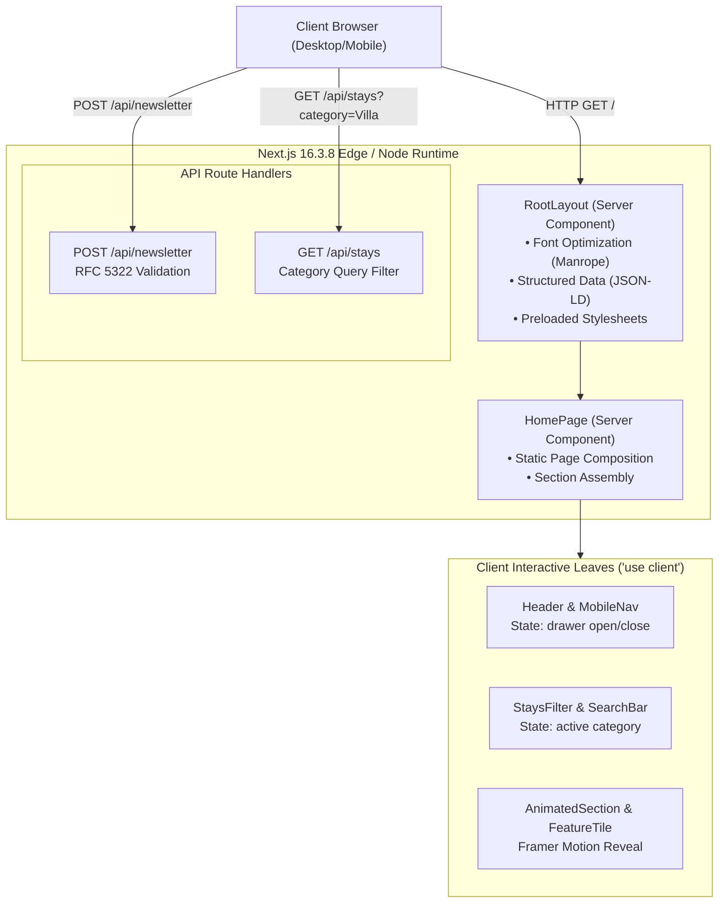
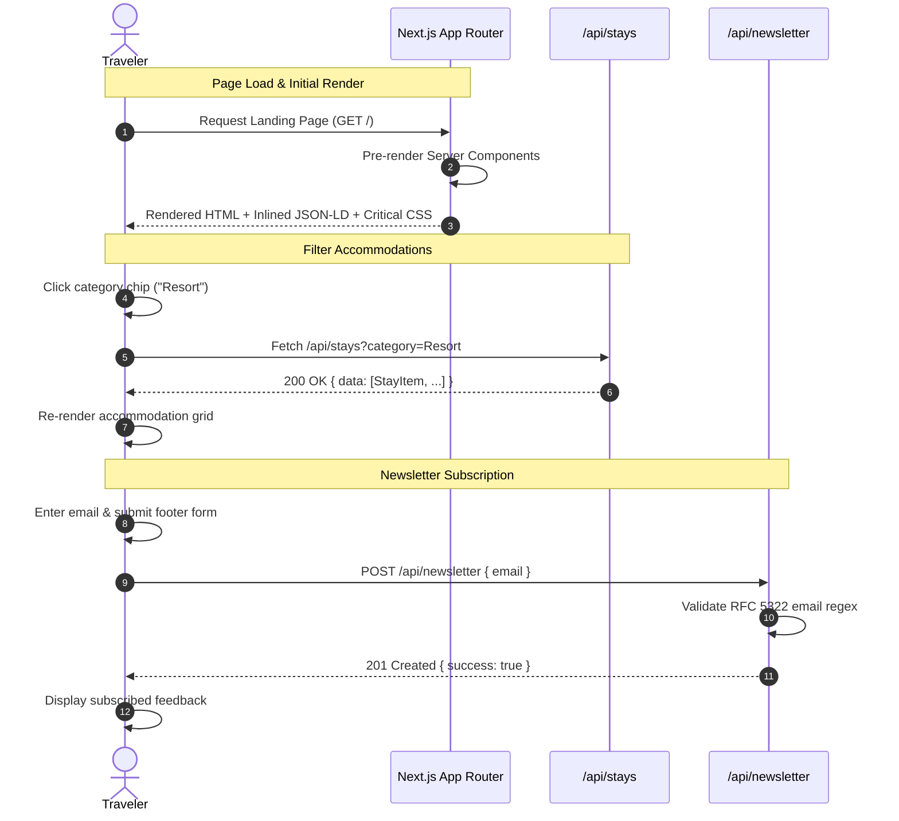

### WANDERLUSH — SYSTEM ARCHITECTURE SPECIFICATION

**Developer:** Aaditya Gunjal - Full Stack Developer

---

## 1. System Context Diagram

---

## 2. Request & Hydration Pipeline

1. **Initial Edge Request:**  
   The user agent requests `GET /`. Next.js executes the Server Components `src/app/layout.tsx` and `src/app/page.tsx` on the server.
2. **HTML Stream & Meta Injection:**  
   HTML is streamed to the browser with inlined JSON-LD structured schemas (`TravelAgency`, `TouristAttraction`), Google Font `Manrope` preload links, and CSS custom property tokens.
3. **Selective Hydration:**  
   Only the client interactive leaves (`Header`, `StaysSection`, `AnimatedSection`) hydrate React event handlers. The rest of the page remains pure HTML/CSS with zero runtime JS penalty.
4. **Optimistic Route Handler Interaction:**
   - Subscribing to the newsletter issues a lightweight `fetch("/api/newsletter", { method: "POST" })`.
   - Category filtering executes through client hook `useStayFilter` with instant state transition.

---

## 3. Data Flow Sequence Diagram

---

## 4. Contact & Support

- **Developer:** Aaditya Gunjal - Full Stack Developer
- **Email:** [aadigunjal0975@gmail.com](mailto:aadigunjal0975@gmail.com)
- **LinkedIn:** [aadityagunjal0975](https://www.linkedin.com/in/aadityagunjal0975/)
- **Phone:** +91 84335 09521
